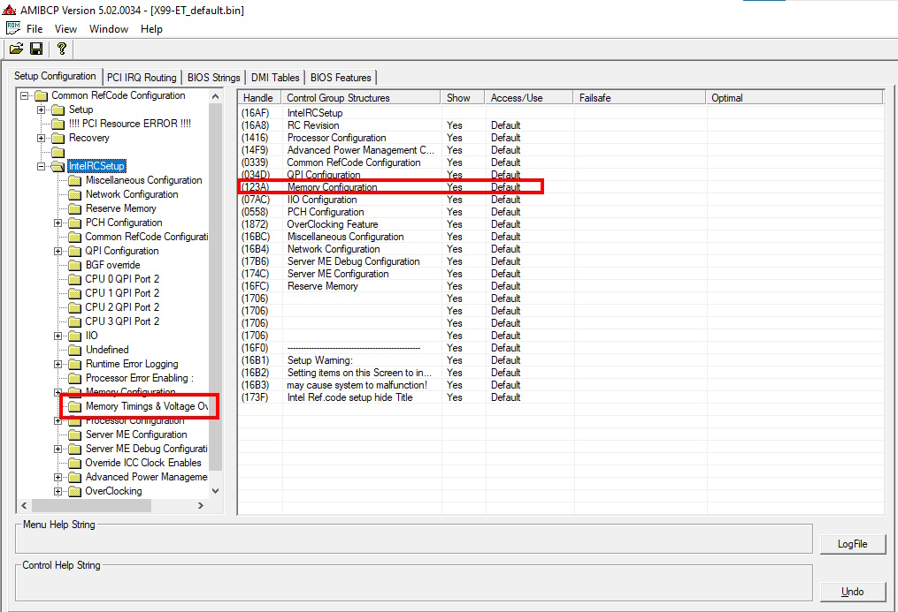
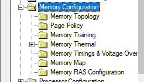
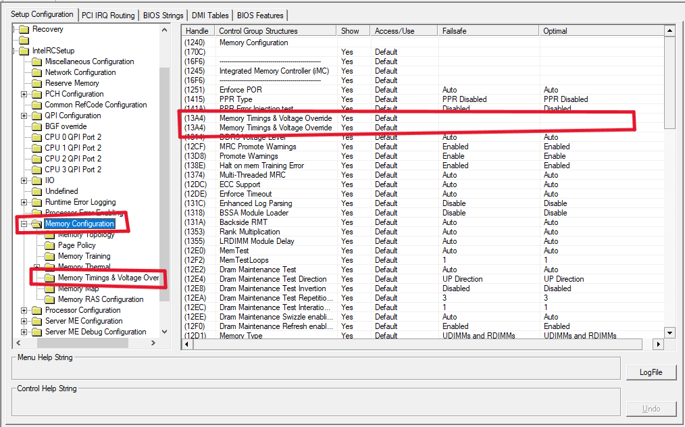
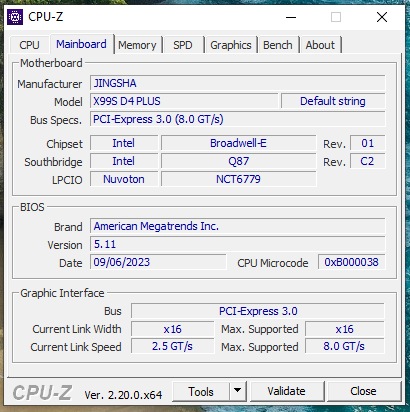
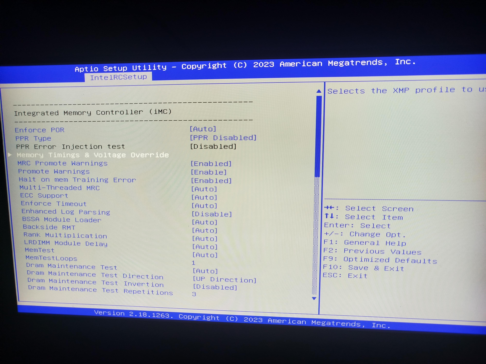
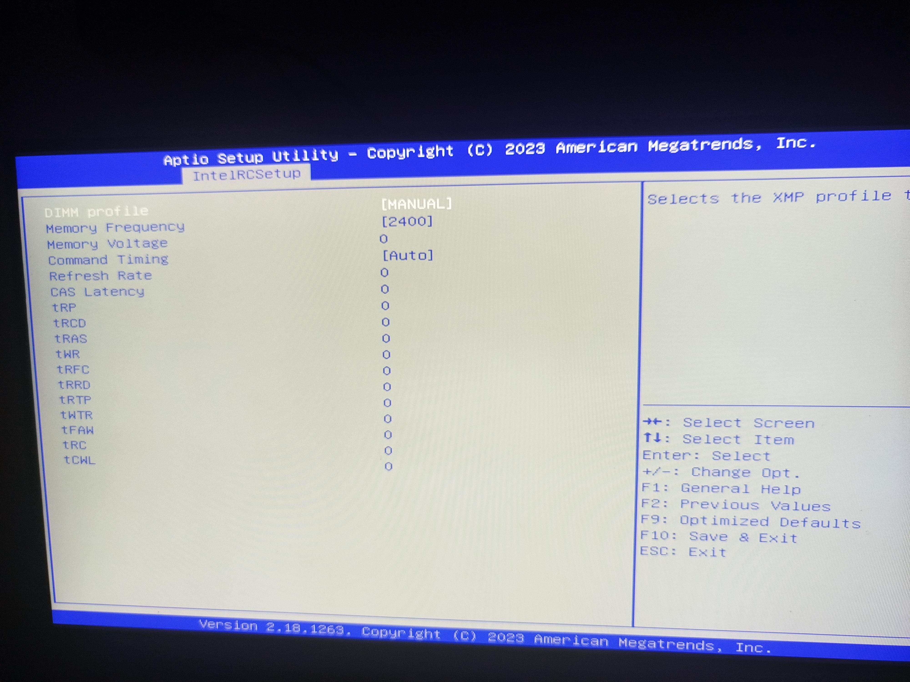
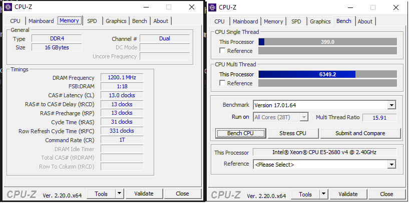

# JINGSHA X99S-D4-PLUS Memory Timings Unlock

Research notes, release assets, and a reproducible patcher for unlocking the hidden **Memory Timings & Voltage Override** menu in the AMI Aptio BIOS used by the **JINGSHA X99S-D4-PLUS** motherboard.

Start with [START-HERE.md](START-HERE.md) if you are new to this project.

## What Was Unlocked

The stock firmware already contains the menu:

```text
Memory Timings & Voltage Override
```

This project exposes it under:

```text
IntelRCSetup > Memory Configuration > Memory Timings & Voltage Override
```

## Also Known As

This board and mod may be searched under slightly different names:

```text
JINGSHA X99S-D4-PLUS
JINGSHA X99S D4 PLUS
JINGSHA X99S-D4 PLUS
X99S D4 PLUS
X99S-D4 PLUS
IntelRCSetup memory timings unlock
AMI Aptio memory timings unlock
Q87 / 8 Series-C220 X99 motherboard
BIOS-region-only memory timings mod
```

## Tested Target

| Item | Tested value |
| --- | --- |
| Board | JINGSHA X99S-D4-PLUS |
| Firmware/PCH reported by FPT | Intel Q87 Express / 8 Series-C220 |
| CPU-Z Southbridge | Intel Q87 Rev. C2 |
| CPU-Z BIOS | American Megatrends Inc. 5.11, date 09/06/2023 |
| BIOS UI | AMI Aptio Setup Utility 2023 |
| Flash chip | Winbond W25Q128BV |
| Full SPI size | 16 MB |
| BIOS region size | 8 MB |
| CPU | Intel Xeon E5-2680 v4 |
| Memory | 2x8 GB SK hynix DDR4-2133 RDIMM |
| Confirmed result | DDR4-2400 after unlock |

See [docs/FIRMWARE-IDENTIFICATION.md](docs/FIRMWARE-IDENTIFICATION.md) for the Q87 / 8 Series-C220 note.

External board reference: [The Retro Web - JINGSHA X99S-D4-PLUS](https://theretroweb.com/motherboards/s/jingsha-x99s-d4-plus).

## Downloads

Firmware binaries are not committed to Git. Published BIOS-region-only images are attached manually to GitHub Releases.

Published release:

- https://github.com/KaioFerreira1/jingsha-x99s-d4-plus-memory-timings-unlock/releases/tag/MEMORY-TIMINGS-UNLOCK-v0.1.0-experimental

If you only want to inspect or use the published BIOS-region image, the scripts are not required. They are kept so the project is auditable: reviewers can see the exact bytes changed, verify the source module hashes, and reproduce the same mod from a matching stock dump instead of blindly trusting a binary file.

### Experimental Unlocked BIOS Region

```text
JINGSHA-X99S-D4-PLUS_Q87-C220_MEMORY-TIMINGS-UNLOCK_v0.1.0-experimental_BIOS-REGION-ONLY.bin
```

SHA256:

```text
E886AC2F4EE250B2DFDC103948C819D74125B16910E6EBEDDBC4F4CEE9FAF901
```

Release notes:

```text
release-assets/v0.1.0-experimental/RELEASE-NOTES.md
```

### Stock Tested BIOS Region

```text
JINGSHA-X99S-D4-PLUS_Q87-C220_STOCK-TESTED_BIOS-REGION-ONLY.bin
```

SHA256:

```text
10E8AE30C7330AD3D3C853E4B72BAC8EC1644A255B20A35D39C4825DC871CE04
```

Release notes:

```text
release-assets/stock-tested-bios-region/RELEASE-NOTES.md
```

## Safety Notice

BIOS modification can brick your motherboard.

I am not responsible for bricked motherboards, data loss, corrupted firmware, unstable memory settings, or any damage caused by using this project.

Use at your own risk.

Before flashing anything:

- keep your own full SPI backup
- validate the image in AMIBCP
- confirm your board and firmware identification
- verify SHA256 checksums
- have an external SPI programmer available

Read [DISCLAIMER.md](DISCLAIMER.md) and [docs/FLASHING-SAFETY.md](docs/FLASHING-SAFETY.md).

## Compatibility Rule

Do not assume compatibility from the "X99" name alone.

The safest compatibility check is the extracted module hash:

```text
Platform PE32 body:
05559A64A4E5BB125C9740AB7C6B49A665201F35CEEA08CC07F62C8EBB69E88B

AMITSESetupData body:
E687C9E53CED3779D99BA69B15456AAEC012DB67F1BB470D094796E962284C76
```

If these hashes differ, treat your BIOS as a different target until manually reviewed.

See [docs/COMPATIBILITY.md](docs/COMPATIBILITY.md).

## Optional Reproducible Patch Method

The release binary is the simple path. The patcher is the verification/research path: it rebuilds the modified module bodies from the documented JSON patch profile and refuses to run if the input hashes or expected bytes do not match.

Required extracted files:

```text
work/pl.bin   -> Platform PE32 body
work/fe.bin   -> AMITSESetupData freeform body
```

Run:

```powershell
powershell -ExecutionPolicy Bypass -File .\scripts\Patch-JINGSHA-X99S-D4-PLUS-MemoryTimings.ps1 `
  -PlatformBody .\work\pl.bin `
  -AmitseSetupDataBody .\work\fe.bin `
  -OutputDirectory .\work\patched
```

Expected outputs:

```text
work/patched/pl_memorytimings_mod.bin
work/patched/fe_memorytimings_mod.bin
work/patched/patch_report.txt
```

The patch data is intentionally stored in readable JSON:

```text
patches/JINGSHA-X99S-D4-PLUS-memory-timings.json
```

See [docs/SCRIPT-WALKTHROUGH.md](docs/SCRIPT-WALKTHROUGH.md) for a step-by-step explanation of the script and [docs/METHOD.md](docs/METHOD.md) for extraction and rebuild details.

If you want to adapt the method for another motherboard, read [docs/PORTING-GUIDE.md](docs/PORTING-GUIDE.md). The script engine can be reused, but the JSON profile, offsets, hashes, and validation data must be recalculated from that board's firmware.

## Validation Evidence

Validated on real hardware:

- AMIBCP showed the unlocked menu under `IntelRCSetup > Memory Configuration`
- real BIOS Setup opened the menu
- Windows booted successfully
- CPU-Z confirmed DDR4-2400

Screenshots:

The first AMIBCP image documents the original menu-placement issue. The following images document the patched tree and real hardware validation.

| Original AMIBCP issue | Patched AMIBCP tree |
| --- | --- |
|  |  |

| AMIBCP menu entry | CPU-Z board identification |
| --- | --- |
|  |  |

| Real BIOS Setup | Unlocked timing controls |
| --- | --- |
|  |  |



For adding board photos, CPU-Z timing screenshots, or stability proof, see [docs/IMAGE-GUIDELINES.md](docs/IMAGE-GUIDELINES.md) and [docs/VALIDATION.md](docs/VALIDATION.md).

## Repository Layout

```text
boards/          Board-specific profile and validation summary
docs/            Method, compatibility, safety, tools, validation
patches/         Human-readable JSON patch profile
patch-notes/     Exact offsets, GUIDs, hashes, and byte changes
scripts/         Fail-closed patcher
screenshots/     Real BIOS Setup evidence
release-assets/  Release notes and SHA256 files for GitHub Releases
```

## Not Included

This repository does not include:

- full SPI dumps
- firmware binaries committed into Git
- AMIBCP binaries
- Intel FPT / Intel ME System Tools binaries
- UEFITool binaries
- automated flashing scripts

## License Scope

The MIT license applies to the original documentation, scripts, patch profiles, and project files in this repository.

Firmware images published as GitHub Release assets are BIOS-region-only reference artifacts from the tested target. They may contain vendor firmware code and are provided as-is for research and recovery use. They are not universal firmware images and are not relicensed as original project source code.

## Credits

This work was inspired by the public LGA2011-3/X99 memory timings unlock method documented at:

- https://e5450.com/socket-2011-3/razblokiruem-upravlenie-tajmingami/

The values in this repository were recalculated from a real JINGSHA X99S-D4-PLUS dump. They are not copied from another board.
